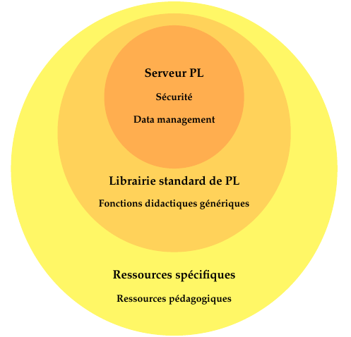

% Premier Langage
% Philosophie et développement d'un jeune projet
% Dominique Revuz et al.

# Le projet PL

Premier Langage PL est un exerciseur en ligne basé sur des technologies informatiques récentes

**Grandes lignes philosophiques :**

* Développé par des enseignants et des étudiants

* Open-source

* Développement ouvert et collaboratif 

* Technologies rationnelles et récentes

* Héritage de l'expérience des projets universitaires

* Intégration dans l'existant plutôt que recréer 

# Un nouvel exerciseur ?

Premier langage n'est pas le premier exerciseur en ligne... Mais les
technologies, les besoins et les moyens ont évolués.

* Nécessité d'un moteur interne up-to-date.

À l'heure du machine learning, du big data et des intelligences
artificielles, besoin d'un coeur sécurisé, flexible, générique et
pouvant tenir la charge. 

* Prévoir la pérennité des contenus pédagogiques, réutiliser au
  maximum les ressources et expériences didactiques.

Portage de ressources d'autres projets vers PL. Langage déclaratif
simple optimisant la ré-utilisation de ressources issues de PL.

# Notre monde est peuplé de génies isolés...

* On voit une grande expérience disséminée partout en France. \
  \footnotesize
  (Richesse incroyable dans toutes les matières de voir des profs non
  informaticiens développant des outils pédagogiques informatiques...)
  \normalsize

* Beaucoup de gens ré-implémentent des outils existants pour leur besoins personnels. \
  \footnotesize
  (Faute de trouver exactement ce que l'on veut...)
  \normalsize

* Les petits projets ne peuvent pas prévoir leur succession. \
  \footnotesize
  (Difficulté de développer avec les méthodes pérennisant son travail...)
  \normalsize

* Les projets existants ne sont pas toujours flexibles. \
  \footnotesize
  (Pilotage du projet, développement fermé, ressources non accessibles...)
  \normalsize

* Dépendre des licences fait mourir certains projets ou créer des situation très pénibles. \
  \footnotesize
  (Financement de certains projet non pérenne...)
  \normalsize

* Les compétences et les technologies sont pourtant là. \
 \footnotesize
  (Absence d'un utilitaire open-source online pouvant exécuter de
  manière sécurisé un très grand nombre d'exercices pédagogiques)
  \normalsize

# Mutualisation des ressources

Exemple de fonctionnalité : dessiner une courbe dans un navigateur web à partir d'une fonction

* En math pour les études de fonctions.

* En chimie pour visualiser l'évolution de la concentration d'un lors d'une réaction.

* En électronique pour afficher un diagramme de Bode.

* En physique pour dessiner un diagramme de phase.

* En biologie pour mesurer l'évolution d'une population de bactérie dans le temps.

* En histoire pour situer les transitions démographiques des états.

* etc...

On a tous besoin d'outils de visualisation... Doit-on tous les re-concevoir et les re-coder ?

# Architecture logicielle de Premier langage

{ width=400px }

# Le serveur PL

* Gestions des connexions avec L.T.I.

* Sécurité : exécute les codes élèves en machines virtuelles

* Montée en charge : déploie les machines virtuelles avec Docker

* Data : base de données avec la technologie Django

* Gros du code en langage Python, nouvelle référence dans l'enseignement

\center\includegraphics[height=1.5cm]{docker.png} \qquad \includegraphics[height=1cm]{django.png} 

\center\includegraphics[height=1.5cm]{lti.png} \qquad \includegraphics[height=1.5cm]{python.png}

# Le serveur PL

* Est conçu par des enseignants-chercheurs en informatique.

* Est principalement programmé par des étudiants en informatique.

* Utilise des technos et frameworks up-to-date.

* Contient le code le plus technique de Premier Langage.

* Résout des problèmes techniques utiles pour l'enseignant mais
  l'enseignant ne veut surtout pas y perdre son temps à le développer.

* C'est le plus gros cadeau que fait PL à la communauté. On ne souhaite pas
  développer un tel coeur souvent (quand les technos deviennent
  obsolètes seulement...)

* Les informaticiens font ce cadeaux mais le besoin de sécurité est
  aussi un peu leur faute. Exécuter du code source soumis en ligne
  n'est pas une action anodine.

# La librairie standard de PL

* Contient des utilitaires techniques pédagogiques utiles au plus grand nombres.

    - Génération et auto-correction de QCM

    - Afficher des courbes à partir d'une fonction
	
	- Exercice de pairing en drag'n drop
	
	- Afficher des images
	
	- ... etc ..
	
* Propose des programmes de génération d'exercices (des builder) et
  des programmes d'évaluation des travaux (des grader)

* Dispose de toute la puissance du langage Python et d'un grand nombre
  de bibliothèque (numpy, scipy, ...)
  
* Possibilité de prévoir des appels à des programmes disponibles dans
  un environnement virtuel (compilateur gcc, bash, ...)
  
* Contient du code proposé par des power-users : principalement des
  profs de toute matières à l'aise avec l'informatique.

# Yggdrasil et ressources spécifiques

* La dernière couche de PL est constituée des ressources pédagogiques
  finales.

* Ressources écrites dans un langage déclaratif simple, pas besoin
  d'être programmeur.
  
* Utilisation mutualisée maximale de la librairie standard.

* Les ressources finales sont appels à des fonctionnalités techniques
  mais ne contiennent plus que des données pédagogiques pérennes et
  potentiellement ré-utilisable dans d'autres projets.
  
* C'est aussi un supermarché que les profs alimentent mais dans lequel
  ils peuvent se servir.

* C'est la partie cruciale à pérenniser voire à enrichir
  automatiquement si possible avec des ressources venant d'autres
  projet existant en automatisant la translation.

# Développement informatique et organisation

* Développement collaboratif et ouvert.

* Développement sur Github.

* Utilisation des outils de développement open-source rationnel.

* Décisions prises à la collégiale pour un design flexible, robuste,
  extensible, générique et adaptatif.
  
* Prévoir le futur au maximum. Même prévoir l'après PL avec des
  stratégies de pérennisation des investissements et ressources
  pédagogiques.
  
* Plus on va vers le coeur, plus les contribution sont
  techniques. Plus on s'écarte du coeur, plus les contributions sont
  pédagogiques. Tout le monde peut trouver une place.

# Un projet jeune

* PL est incomplet. \
  (Longue roadmap mais tout n'est pas fait...)

* PL est encore très flexible. \
  (La conception n'étant pas totalement figée, vous pouvez venir dessiner PL avec nous...)

* PL peut encore bouger. \
  (Les nouveaux contributeurs motivés nous influencent et façonnent PL)

* PL a et aura encore des bogues. \
  (C'est aussi la beauté de la jeunesse...)

* PL bouge vite. \
  (Les bugs sont corrigés rapidement et encore plus vite si demain vous utilisez PL...)
  
  
  
# Premier langage

\center Par des profs, pour des profs !

\bigskip
\bigskip
\bigskip

\center Rejoignez-nous avec vos compétences pour une expérience gagnant-gagnant !
